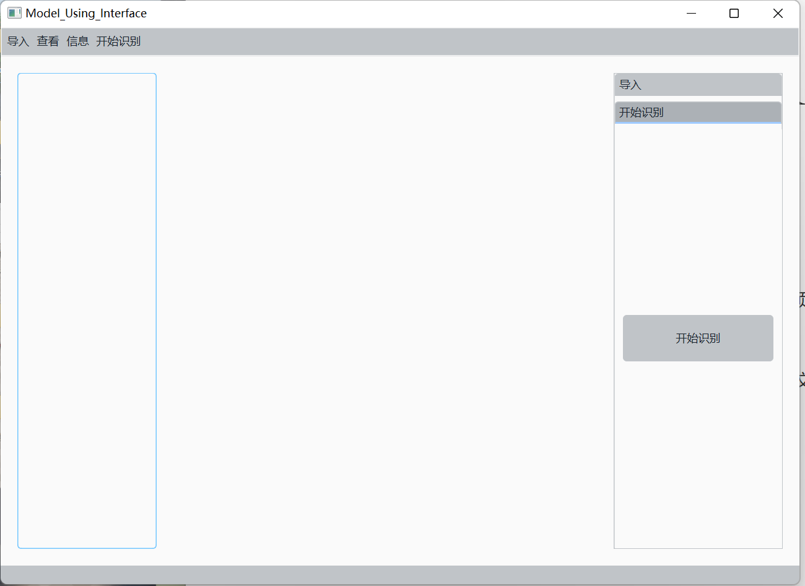
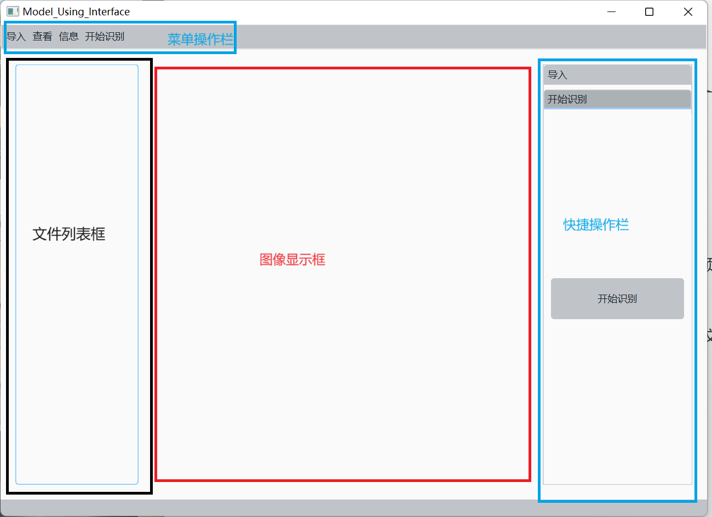
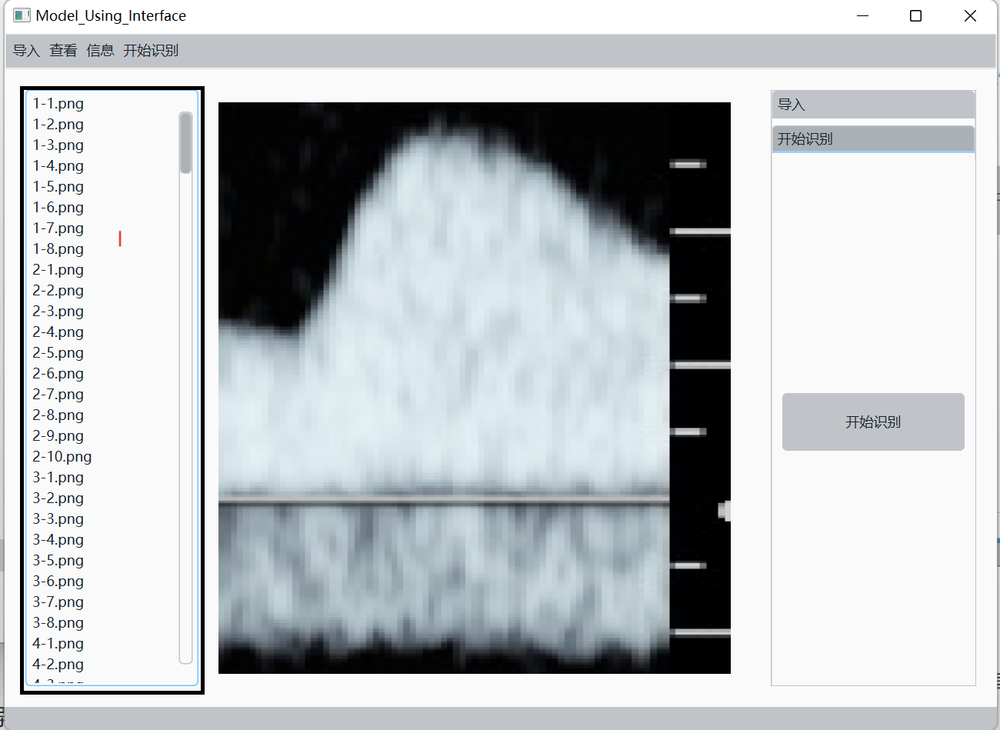
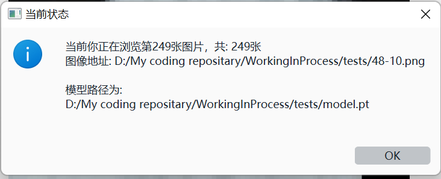
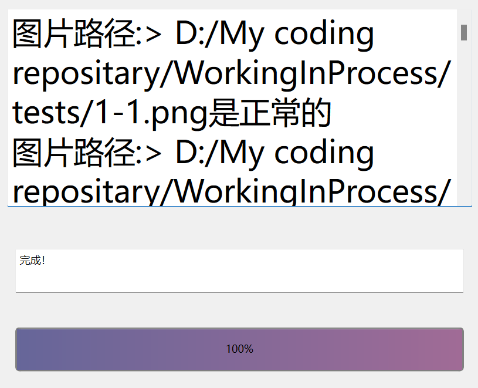

# Read Me First

## 项目说明

### v1.5(Pre2.0)

报告生成完成，对所有潜在的耗时操作做了友好处理，生成对话框提示用户进度

支持部分记忆功能（模型文件锁定 + 解析路径 + 生成报告路径备忘）

### v1.4

报告分析完成，且加入部分异常处理极值

### v.1.3

支持OCR模块功能

报告分析框架搭建完成

报告生成器搭建完成

### v1.2

现在支持了自动分割波形识别的功能，对于无法分割的图像将会使用默认的处理方式进行处理

### v1.1

现在支持简单的语音识别功能,基于此派生的功能将会在后续进行更新

语音识别库使用了PyAudio和KaldiRecognizer进行音频和语音上的处理

### v1.0

#### 简要

​	此软件为用户侧使用训练结束的模型进行预测的一个Demo用户软件，目前基本支持如下的操作：

> - 批量导入待识别图片
> - 导入待使用的模型（目前接口支持`*.pt`文件）
> - 使用模型解析图片
> - 生成简单的图片是否正常的报告

​	如下图所示，为默认的初始化界面

#### UI说明：

#### 图片选择

​	可以选择单击菜单栏的导入图片功能批量的导入（方式是`Crtl + 单击`复选），或者是调整右侧的工具箱置导入部分单击导入图片按钮。

​	如图所示：这是导入图片后的UI局貌：

​	你可以点击图像名称来实现图像之间的浏览切换（I处），按下键盘的左右键方式来浏览前后的图片。浏览到达结尾时会有信息提示框提示。

#### 模型导入

​	当前支持pt文件导入，可以将训练好的模型放置在任何位置后，使用导入模型选择模型文件。

#### 信息查看

​	单击菜单栏，查看当前的信息情况如何：

#### 开始训练与结果浏览

​	保证图像和模型导入结束后，方可点击开始训练按钮或者是点击菜单栏上的开始训练，稍等片刻即可询问保存位置，确定保存位置后看可以在文本框中浏览结果

## 可能出现的错误

pytesseract.pytesseract.TesseractNotFoundError: tesseract is not installed or it's not in your PATH：请搜索如何下载Tesseract并保证自己可以在cmd命令行中使用。然后重启软件和（如果您是开发者，使用Python环境时也需要重启IDE）尝试